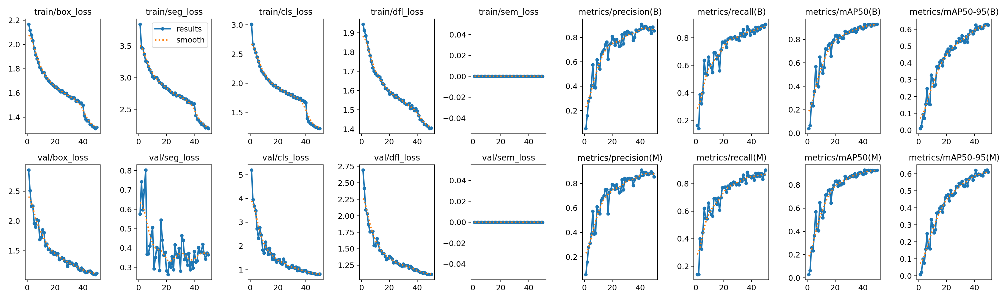
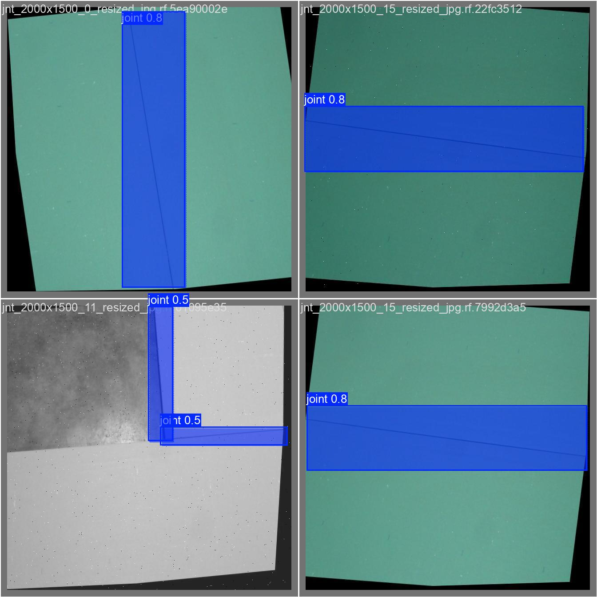

if it means anything then please check this out(the accidental Embeddedsys assignment, partially completed it with some test cases and a time diagram):->https://github.com/levanel/origin-test

# Prompted Segmentation for Drywall QA

**Goal:** Develop a fast text conditioned segmentation model that detects drywall cracks and taping areas.

## Approach & Model Choice

I used an input prompt routed YOLOv8n architecture to optimize for speed and maintaining high accuracy. When selecting a model, I considered 3 things which lead me to chose YOLOv8n:

1. **Project requirement:** While I considered options like YOLOv10 or a more specialized model like YOLO-BCCD, achieving fast binary masks required me to prioritize architectural simplicity over experimental features.
2. **Reliability:** I have prior experience with YOLOv8n, and its tested, its stability, it ensures we dont waste deadline hours debugging dependency conflicts or unproven framework bugs.
3. **Robotics Readiness:** I assume this acts as the vision system for a physical robot, YOLOv8s guaranteed tests provide a strict operational safety and reliability that newer models cant yet guarantee yet.

## Data Splits

* **Train:** 6187
* **Valid:** 202
* **Test:** 0*

*\*The provided dataset lacked ground truth annotations for the test split, making quantitative evaluation (mAP/Dice) unfair. To evaluate real world generalization, the model underwent qualitative testing on the unlabeled test split.*

## Metrics & Footprint

* **Mean Intersection over Union (mIoU):** 0.9237
* **Dice Coefficient (F1 Score):** 0.9603
* **mAP50:** 0.924
* **Average Inference time:** 9.9ms/img
* **Model size:** 6.8 MB
* **Train time:** 4.319 hours

## Training Performance

## Visual Predictions

Visual inspection of the generated binary masks confirms the model successfully generalized to entirely unseen data, accurately segmenting both hairline cracks and taping areas. 

### Brief Failure Note
While precision was high, qualitative analysis and sanity tests showed that the model occasionally overpredicted taping areas (outputting massive block masks). Upon reviewing the ground truth dataset, it was discovered that source annotations often used multiple broad, panel wide boxes rather than tight seam masks. 

The model successfully generalized this flawed labeling behavior. I think its very clear why this is problematic, and future iterations would require cleaning the source dataset for tighter pixel-level masks.
